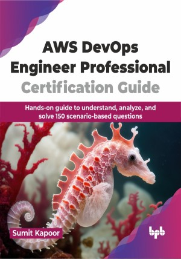

# AWS DevOps Engineer Professional Certification Guide

Crack the exam and become an expert in provisioning, operating, and managing distributed application systems on the AWS platform

This is the repository for [AWS DevOps Engineer Professional Certification Guide
](https://bpbonline.com/products/aws-devops-engineer-professional-certification-guide?_pos=1&_sid=07dec5b6d&_ss=r&variant=43563234066632),published by BPB Publications.

## About the Book
The AWS DevOps Engineer Professional Certification Guide is highly challenging and can significantly boost one's career. It features scenario-based questions with lengthy descriptions, making comprehension tough. This book focuses extensively on AWS Developer Tools, CloudFormation, Elastic Beanstalk, OpsWorks, and other crucial topics, representing the exam's domain.

The readers can easily prepare for the AWS Certified DevOps Engineer - Professional exam with this guide drafted with a focus on managing infrastructure and applications on AWS. It covers secure version control with CodeCommit, automated code building with CodeBuild, and streamlined updates with CodeDeploy and CodePipeline. You will learn to create secure CI/CD pipelines and define AWS infrastructure and applications with CloudFormation. The readers will explore the management of multiple AWS accounts, security tools, and automation with OpsWorks and Elastic Beanstalk. You will also discover strategies for scalability, disaster recovery, monitoring with CloudWatch, and performance analysis with Kinesis Data Streams. Finally, you will learn to implement automated responses and security best practices with AWS Config and Inspector.

Successfully passing this exam will help you gain advanced technical skills needed to become a DevOps subject matter expert and earn a good remuneration in the IT industry.

## What You Will Learn
• Set up automated code building, testing, and deployment.

• Automate the configuration and deployment in AWS for efficiency.

• Design infrastructure and applications on AWS that handle high traffic and unexpected situations.

• Gain insights into infrastructure and application performance on AWS with advanced monitoring tools.

• Learn about best practices for securing infrastructure and applications on AWS, like access control, encryption, vulnerability scanning, and incident response procedures.
